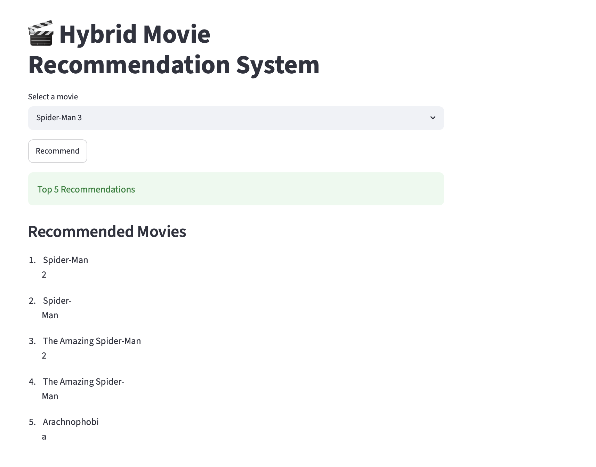

## 🔗 Links

- 🌐 Live Demo: https://hybrid-movie-recommendation-system-qge29t7zennsut8enfyixd.streamlit.app/
- 💻 Source Code: https://github.com/Adarshpatkar/hybrid-movie-recommendation-system

# 🎬 Hybrid Movie Recommendation System

A content-based movie recommendation system built using Natural Language Processing (NLP) and Machine Learning. The system analyzes movie metadata such as genres, keywords, cast, director, and overview to recommend similar movies based on content similarity.

The project includes an interactive web application built with **Streamlit**, allowing users to select a movie and instantly receive personalized recommendations.

---

## 🚀 Features

- Recommend top 5 similar movies based on content.
- Interactive Streamlit web application.
- Case-insensitive movie search.
- NLP preprocessing pipeline for movie metadata.
- Content-based recommendation using Cosine Similarity.
- Fast inference using precomputed similarity matrix and Pickle serialization.

---

## 🛠️ Tech Stack

- Python
- Pandas
- NumPy
- Scikit-learn
- NLTK
- Streamlit
- Pickle

---

## 📂 Project Structure

```
Hybrid-Recommendation-System/
│
├── app.py
├── movies.pkl
├── similarity.pkl
├── requirements.txt
├── README.md
│
├── data/
│   ├── tmdb_5000_movies.csv
│   └── tmdb_5000_credits.csv
│
├── notebooks/
│   └── Movie_Recommendation.ipynb
```

---

## ⚙️ How It Works

1. Load and merge the TMDB Movies and Credits datasets.
2. Extract important features:
   - Genres
   - Keywords
   - Top 3 Cast Members
   - Director
   - Movie Overview
3. Perform NLP preprocessing:
   - Tokenization
   - Remove spaces from names
   - Lowercasing
   - Stemming
   - Stop-word removal
4. Convert movie tags into numerical vectors using CountVectorizer.
5. Compute pairwise movie similarity using Cosine Similarity.
6. Save processed objects using Pickle.
7. Load the saved objects in Streamlit for fast movie recommendations.
8.Before running the Streamlit application, execute the notebook once to generate:

    - movies.pkl
    - similarity.pkl

---

## 🧠 Machine Learning Pipeline

Dataset
→ Data Cleaning
→ Feature Engineering
→ NLP Preprocessing
→ CountVectorizer
→ Cosine Similarity
→ Recommendation Engine
→ Pickle Serialization
→ Streamlit Deployment

---

## ▶️ Installation

Clone the repository

```bash
git clone <repository-url>
```

Move into the project directory

```bash
cd Hybrid-Recommendation-System
```

Install dependencies

```bash
pip install -r requirements.txt
```

Run the Streamlit application

```bash
streamlit run app.py
```

---

## 📸 Sample Output

Select a movie from the dropdown and click **Recommend**.

Example:

Input:

```
Spider-Man 3
```

Output:

```
1. Spider-Man 2
2. Spider-Man
3. The Amazing Spider-Man 2
4. The Amazing Spider-Man
5. Arachnophobia
```

---

## 📸 Application Preview


The Streamlit application allows users to select a movie from the dropdown menu and instantly receive the top 5 content-based movie recommendations.

---

## 🔮 Future Improvements

- Display movie posters using the TMDB API.
- Add movie ratings and genres in the recommendations.
- Support fuzzy movie search.
- Implement collaborative filtering.
- Replace CountVectorizer with transformer-based embeddings.
- Deploy the application on Streamlit Community Cloud.

---

## 📚 Dataset

TMDB 5000 Movie Dataset

- tmdb_5000_movies.csv
- tmdb_5000_credits.csv

---

## 👨‍💻 Author

Adarsh Patkar